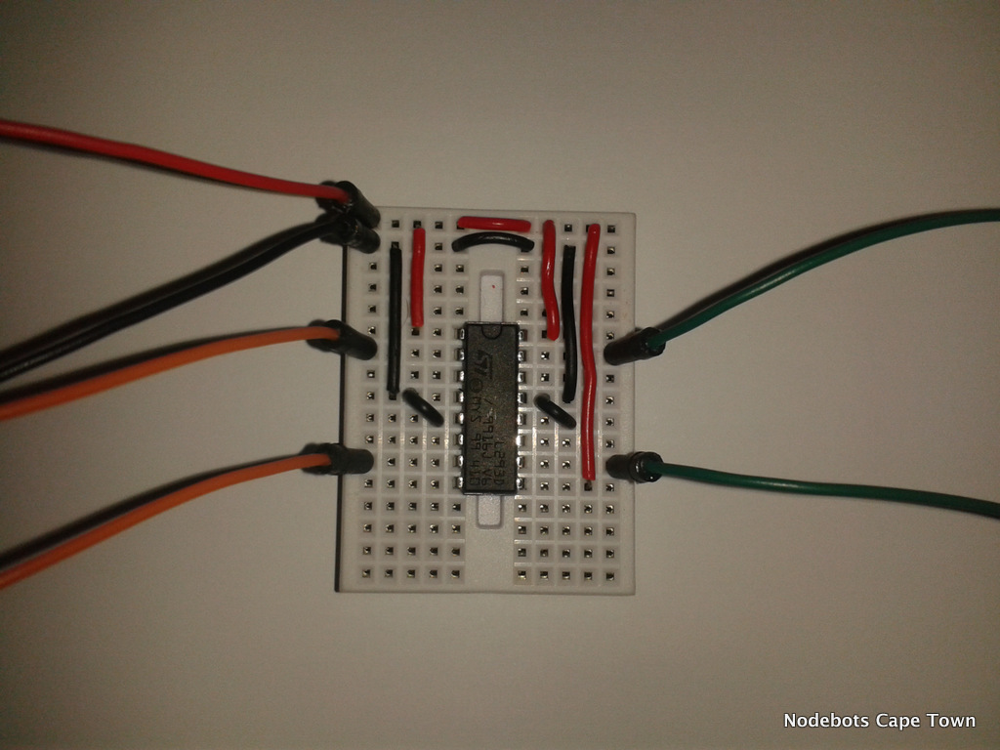

# Motor Driver

We are using a L293D Dual H-Bridge chip to drive the motors of the Visabot.

##Setup

You will need to wire the supplied chip up on the mini breadboard. Wires are supplied.

For some background information you can watch this video: https://www.youtube.com/watch?v=5nDaHJqruq0

##Before:

##After:

##H-Bridge Setup schematic

## Program the Motor Driver

By setting a Motors pins to high and low will make the motors move in the direction where the Pin is set to high.

Learn more about pins here:

https://github.com/rwaldron/johnny-five/wiki/Pin

You can use analog write (PWM pins) to control the speed of your bot.

You can also use the motor class.

https://github.com/rwaldron/johnny-five/blob/master/docs/motor-hbridge.md