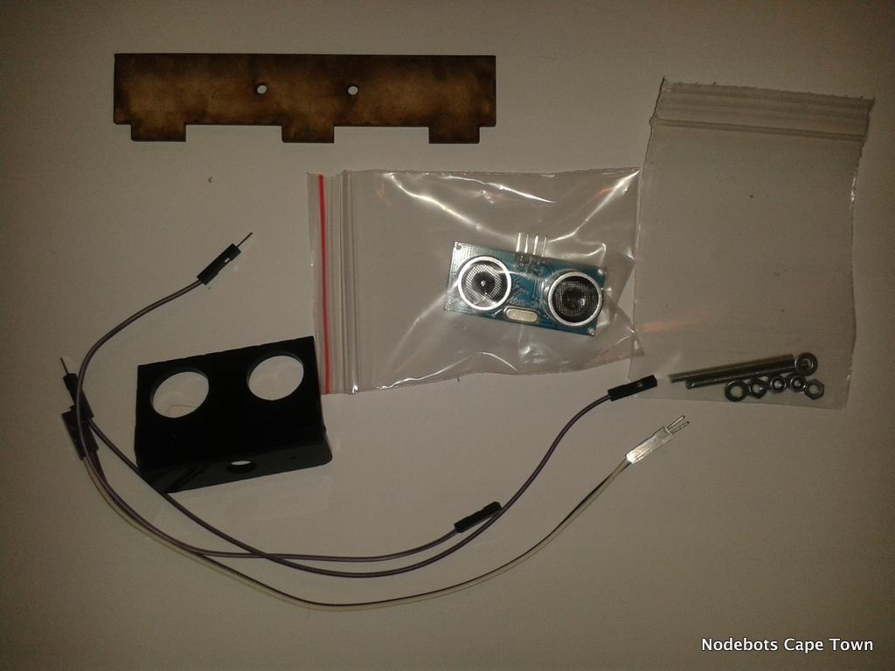
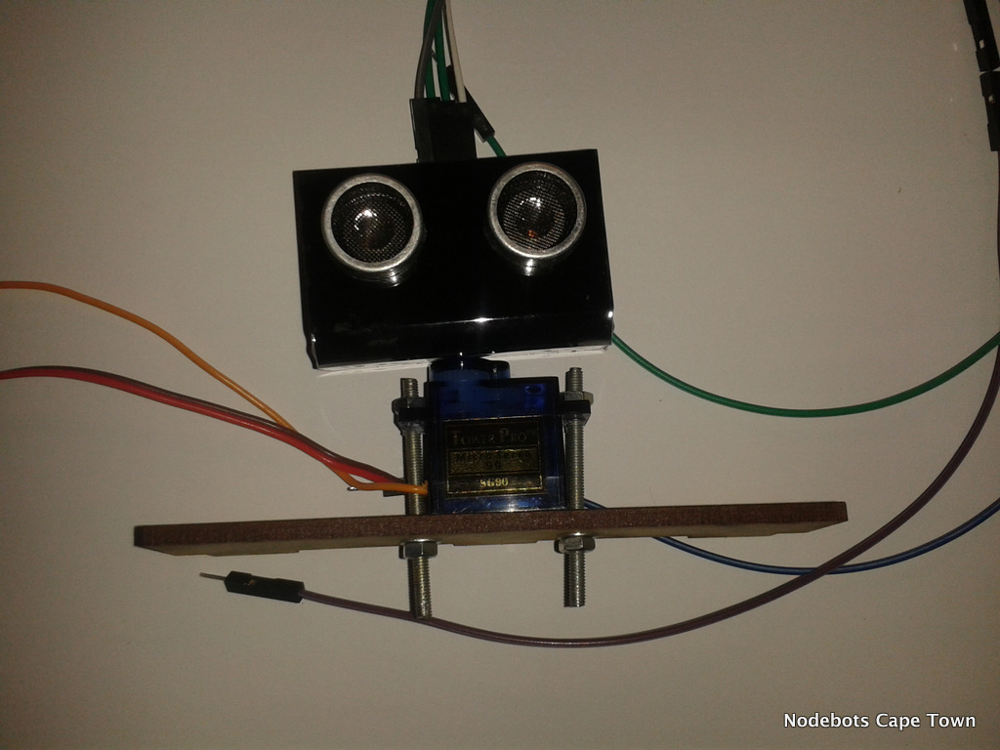

#Ultrasonic support

By using an ultrasonic sensor we give the Visabot a sense of sight. Comibining it with a small servo we can cover a larger with the sensor.

Build the Ultrasonic model attached to the Mini Servo by following these instructions:

### Step 1

### Step 2

### Step 3

You will need to solder a cable like this. Heat shrink is available on request.

### Step 4

Once the ultrasonic module is built attach it to the front of your Visabot. Attach the wires as required.

*Servo examples*

* [A basic servo example](http://node-ardx.org/exercises/4)

* [The Servo API](https://github.com/rwaldron/johnny-five/wiki/Servo)

* [Move a Servo using the keyboard](https://github.com/rwaldron/johnny-five/blob/master/docs/servo-keypress.md)

*Ping*

The Ultrasonic sensor we are using, HC-SR04, is called a Ping object in Johnny-Five.

* [A basic Ping example](https://github.com/rwaldron/johnny-five/blob/master/docs/ping.md)

* [The Ping API](https://github.com/rwaldron/johnny-five/wiki/Ping)

Loads more examples at: https://github.com/rwaldron/johnny-five/blob/master/docs