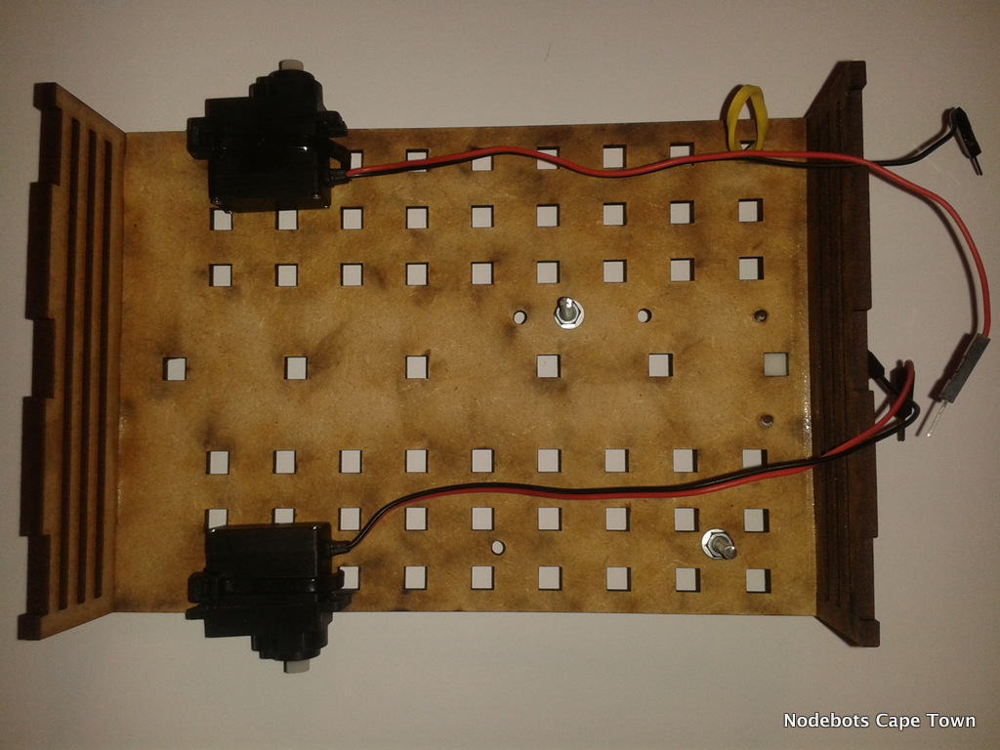
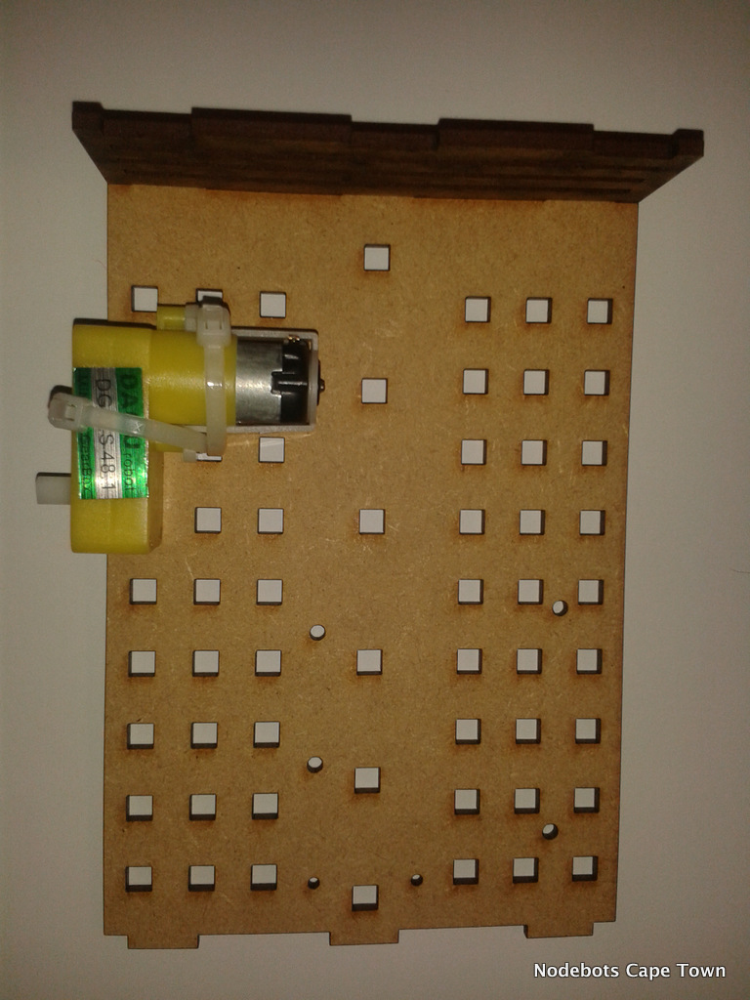
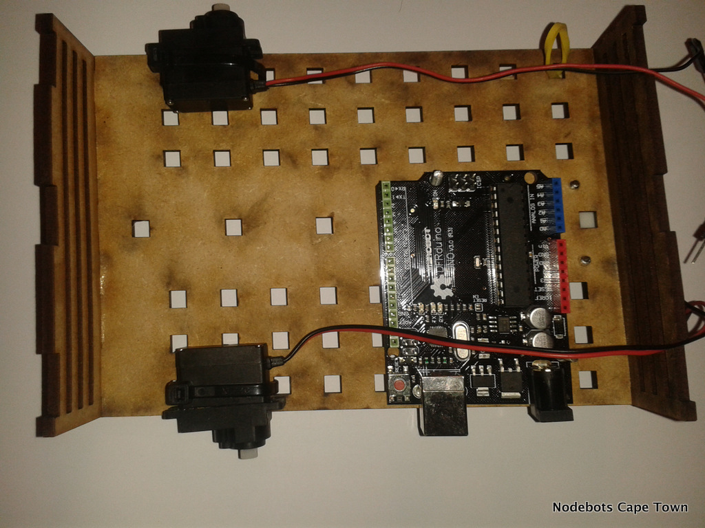
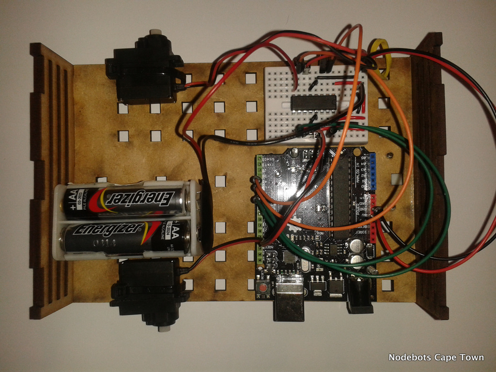

#Build the Bot

##Build steps

Building the Visabot is fairly simple. Please note that on the base plate the green dots need to point upwards.

The parts required for the built is in yout container

Attach the Servo motors using the supplied cable ties. Add the supplied screws add pins to hold the Arduino

Attaching the little yellow motors are slightly different. You need four cable ties in total.

Add the Arduino - you might want to bolt the Arduino onto the base plate. Bolt available on request

Add the motor Driver and the batteries. Ensure both is wired up to the Arduino correctly.

Add the top plate over the Visabot

